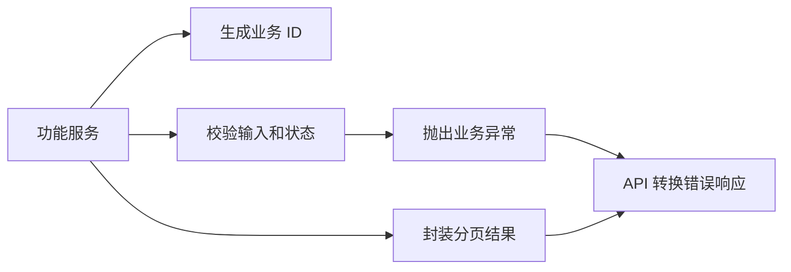

# 通用基础类型架构

```mermaid
flowchart LR
    A[功能服务] --> I[生成业务 ID]
    A --> V[校验输入和状态]
    V --> E[抛出业务异常]
    A --> P[封装分页结果]
    E --> API[API 转换错误响应]
    P --> API
```

[ids.py](ids.py) 生成标识，[errors/base.py](errors/base.py) 定义通用异常，[pagination.py](types/pagination.py) 定义分页结果。这里不负责具体功能的存储或 HTTP 响应。领域数据见 [DOMAIN.md](DOMAIN.md)。
