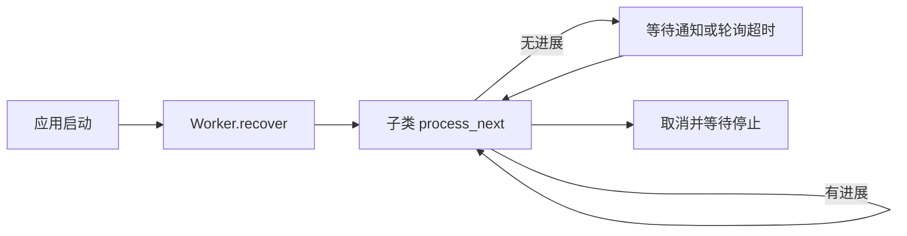

# 共享任务调度架构

```mermaid
flowchart LR
    A[应用启动] --> R[Worker.recover]
    R --> P[子类 process_next]
    P -->|有进展| P
    P -->|无进展| W[等待通知或轮询超时]
    W --> P
    P --> S[取消并等待停止]
```

[Worker](worker.py)管理单协程生命周期、通知和轮询；子类负责恢复与任务处理。各功能的 Workflow 按自身错误规则使用 [RetryPolicy](config/retry.py)，共享 [调度类型](types/models.py) 不替代各任务的状态。领域数据见 [DOMAIN.md](DOMAIN.md)。
