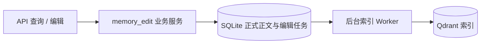

# 用户查询与编辑架构

## 总览

```mermaid
flowchart LR
    A[API 查询 / 编辑] --> M[memory_edit 业务服务]
    M --> S[(SQLite 正式正文与编辑任务)]
    S --> W[后台索引 Worker]
    W --> Q[(Qdrant 索引)]
```

当前只有 `memory_edit` 功能。查询、保存与后台索引的详细调用链见 [memory_edit/ARCHITECTURE.md](memory_edit/ARCHITECTURE.md)，领域数据见 [DOMAIN.md](DOMAIN.md)。各功能业务层定义端口，存储实现接口，API 负责入口与装配。
